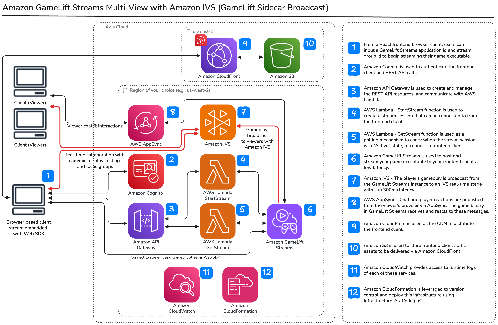
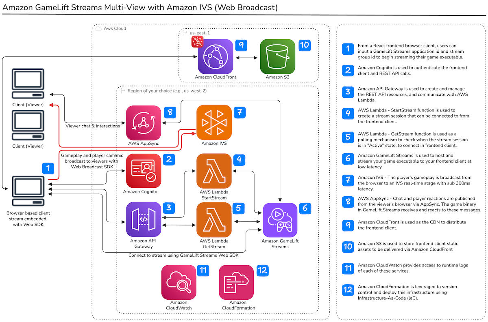

# Welcome to the Amazon GameLift Streams Multiview with Amazon IVS React Starter Sample

The Amazon GameLift Streams Multiview with Amazon IVS React Starter sample repository allows developers to quickly get up and running with [Amazon GameLift Streams](https://aws.amazon.com/gamelift/streams/) and [Amazon IVS Real-Time Stages](https://aws.amazon.com/ivs/). Amazon GameLift Streams helps game developers deliver game streaming experiences at up to 1080p resolution and 60 frames-per-second (fps) across devices. Publishers can deploy their game content in minutes, without modifications, onto fully-managed cloud-based GPU instances and deliver them directly to any device with a web browser. Learn more about Amazon GameLift Streams [here](https://aws.amazon.com/gamelift/streams/).

This demo deploys a comprehensive streaming platform with dual-role functionality:

- **Player Role**: Stream GameLift gameplay and webcam to viewers via Amazon IVS Real-Time Stages
- **Viewer Role**: Watch live streams, participate in real-time chat, and send reactions
- **Real-Time Features**: Chat messaging, emoji reactions, and real-time video streaming powered by Amazon IVS and AWS AppSync

The application is built with [ReactJS](https://react.dev/), an API built with [Amazon API Gateway](https://aws.amazon.com/api-gateway/), [AWS Lambda](https://aws.amazon.com/lambda/) and [Amazon Cognito](https://aws.amazon.com/cognito/) for authorization and authentication, [Amazon IVS Real-Time Stages](https://aws.amazon.com/ivs/) for real-time streaming, and [AWS AppSync](https://aws.amazon.com/appsync/) for real-time chat and reactions.

**Want to integrate viewer interactions directly into your game?** See [GAME_INTEGRATION.md](./GAME_INTEGRATION.md) for a guide on connecting your game client to AWS AppSync to enable real-time viewer chat and reactions that affect gameplay.

**Want to enable couch co-op control for viewers?** See [COUCH_COOP_CONTROL.md](./COUCH_COOP_CONTROL.md) for a guide on the Couch Co-op Control feature, which allows viewers to spawn and control couch co-op players directly in supported games using keyboard commands sent via AppSync. This feature includes configurable rate limiting (20 RPS by default) and could be enhanced with alternative pub/sub solutions for higher throughput.

**Want to use PubNub (or another provider) for couch co-op commands?** The couch co-op transport layer is abstracted behind a `MessageTransport` interface, allowing you to swap the underlying pub/sub provider by changing a single constant (`COUCH_COOP_TRANSPORT` in `constants.ts`). Chat and viewer invite messages always flow through AppSync regardless of this setting. See [PUBNUB_TRANSPORT_SETUP.md](./PUBNUB_TRANSPORT_SETUP.md) for setup instructions, SSM configuration, and how to add custom providers.

## Application Features

This sample demonstrates three distinct user experiences:

1. **Player View** (`player@ivs.rocks`): Stream GameLift gameplay and webcam to IVS Real-Time Stage, interact with viewers through chat, and send reactions
2. **Viewer View** (`viewer@ivs.rocks`): Watch live gameplay and webcam streams from the player, participate in real-time chat, and send reactions
3. **Interactive Play Testing**: Unified interface enabling real-time play testing sessions where multiple participants can join with webcam and microphone to provide feedback while watching gameplay, with dynamic control transfer allowing participants to request and assume gameplay control

All views include real-time chat and reaction features powered by AWS AppSync Event API, with automatic reconnection handling and message queuing for reliability.

## How to Deploy the Demo Application

This project uses the AWS Cloud Development Kit (CDK) to deploy the AWS Infrastructure. You can learn more about CDK [here](https://aws.amazon.com/cdk/). The CDK stacks included deploy the required resources for a fully functioning demo web page, but do not deploy the Amazon GameLift Streams resources themselves. You can add Amazon GameLift Streams application and stream group resources at any time, before or after the deployment of this sample. There is additional information about creating Amazon GameLift Streams resources below in the `Creating a GameLift Stream Application and Stream Group` section.

Amazon IVS Broadcasting of GameLift Streams play can be accomplished via either direct broadcasting or the Amazon IVS Web Broadcast SDK (restreaming from the player's browser). See [GAMELIFT_IVS_DIRECT_BROADCAST.md](./GAMELIFT_IVS_DIRECT_BROADCAST.md) for a guide on the GameLift-IVS Direct Broadcast feature.

### Direct Broadcast Architecture



### Web Broadcast Architecture



### Deploying

The Application is deployed through 3 CDK stacks:

1. **AmazonGameLiftStreamsReactStarterAPIStack:** Deploys the serverless API. **This stack must be deployed to a valid GameLift Streams primary region** because the Lambda functions use the GameLift Streams SDK client, which makes API calls in the region where the Lambda is deployed. This deployment includes:
    1. `StartStream`, `GetStream`, and `CreateStreamSessionConnection` Lambda functions for GameLift Streams
    2. Amazon API Gateway with Cognito authorization
    3. Amazon Cognito User Pool for authentication
2. **AmazonGameLiftStreamsReactStarterIVSStack:** Deploys Amazon IVS Real-Time Stage and AppSync Event API for player-viewer streaming and real-time chat. **This stack must be deployed to the same region as the API stack.** This deployment includes:
    1. Amazon IVS Real-Time Stage for real-time video streaming
    2. AppSync Event API for real-time chat and reactions
    3. AppSync API Key and channel namespace configuration
    4. AWS Systems Manager Parameter Store parameters for sensitive configuration (AppSync credentials, stream keys)
    5. GetConfig Lambda function that serves sensitive configuration to the frontend at runtime via the `/config` API endpoint
    6. Integration with the API Gateway from stack 1 for secure token generation and configuration retrieval

    **Note:** This stack depends on resources from the API stack and must be deployed after it.

3. **AmazonGameLiftStreamsReactStarterFrontendStack:** Deploys a single page application (SPA) to `us-east-1`. This deployment includes:
    1. Amazon S3 bucket containing the demo SPA
    2. Amazon CloudFront CDN distribution distributing the SPA
    3. AWS WAF to secure the CloudFront distribution

## Prerequisites

This guide assumes you have the following packages already installed. If not, please install before proceeding.

- **node** (v18 or above): https://nodejs.org/en/download/ (Optionally: install node and npm with the Node Version Manager (nvm): https://github.com/nvm-sh/nvm)
- **npm**: https://docs.npmjs.com/downloading-and-installing-node-js-and-npm
- **aws-cli**: https://docs.aws.amazon.com/cli/latest/userguide/getting-started-install.html
- **aws-cdk**: https://docs.aws.amazon.com/cdk/v2/guide/cli.html

You can use `aws configure` via aws-cli or other mechanism to authenticate your terminal in order to use CDK. You can find additional information on configuring security credentials [here](https://docs.aws.amazon.com/cdk/v2/guide/configure-access.html).

### Important: Region Requirements

> [!IMPORTANT]  
> Amazon GameLift Streams is only supported in specific AWS regions. **The API and IVS stacks must be deployed to a valid GameLift Streams primary region** because the Lambda functions use the AWS SDK GameLift Streams client, which makes API calls in the region where the Lambda is deployed.

It is important to understand the difference between Amazon GameLift Streams `Primary locations` and `Remote locations`:

- **Primary location**: The region where you create your initial Amazon GameLift Streams resources and deploy this application's infrastructure
- **Remote locations**: Additional regions where you can extend coverage to host your application and stream sessions globally

> [!IMPORTANT]  
> **Make sure to set your aws-cli default region to one of the supported Amazon GameLift Streams primary regions before deploying the stacks.** You can find additional information about supported primary regions and remote regions [here](https://docs.aws.amazon.com/gameliftstreams/latest/developerguide/regions-quotas-rande.html).

### Deployment

1. Run `npm run setup` at the root of the repository. This command installs node depedencies, creates a build directory for the frontend production build and creates a gamelift-streams-websdk directory to include the Amazon GameLift Streams Web SDK in step 4 below.
2. **Configure application constants**: Copy the template configuration file and prepare it for your AWS resources:
    ```bash
    cp amazon-gamelift-streams-react-starter-frontend/src/utils/constants.template.ts amazon-gamelift-streams-react-starter-frontend/src/utils/constants.ts
    ```
    **Note**: The `constants.ts` file contains non-sensitive configuration such as Cognito, API Gateway, GameLift Streams, and IVS settings. Sensitive values (AppSync API key, endpoints, and stream keys) are stored securely in AWS Systems Manager Parameter Store and fetched at runtime via a Lambda endpoint. The `constants.ts` file is excluded from version control.
3. Install Lambda function dependencies by running `npm install` in each Lambda directory:
    ```bash
    cd lambda/StartStream && npm install && cd ../..
    cd lambda/GetStream && npm install && cd ../..
    cd lambda/CreateStreamSessionConnection && npm install && cd ../..
    cd lambda/GetStageToken && npm install && cd ../..
    cd lambda/GetConfig && npm install && cd ../..
    ```
4. From the Amazon GameLift Streams getting started page (https://aws.amazon.com/gamelift/streams/getting-started/#Resources), download the latest Amazon GameLift Streams Web SDK bundle. For this sample application you do not need the `GameLiftStreamsSampleGamePublisherService` directory within the downloaded Web SDK bundle, only the other Web SDK files. Copy the three gameliftstreams-version.d.ts, .js, and .mjs files as well as the LICENSE.txt file to the `/amazon-gamelift-streams-react-starter-frontend/src/gamelift-streams-websdk` directory.
5. Run `cdk bootstrap` if you have not previously deployed infrastructure using cdk into your AWS account. You can find additional information on this process [here](https://docs.aws.amazon.com/cdk/v2/guide/bootstrapping.html).
6. Run `cdk deploy AmazonGameliftStreamsReactStarterAPIStack` at root level of this repository, to deploy the API and save the resource identifier outputs required for the frontend build.
7. Run `cdk deploy AmazonGameliftStreamsReactStarterIVSStack` at root level of this repository, to deploy the IVS Real-Time Stage, AppSync Event API, and SSM Parameter Store configuration. This stack uses the same API Gateway and Cognito from step 6. Sensitive configuration values (AppSync API key, endpoints, channel name) are automatically stored in AWS Systems Manager Parameter Store and served to the frontend at runtime via a `/config` API endpoint.
8. **(Optional) Set the STREAM_KEY for RTMP ingest**: The `STREAM_KEY` parameter is deployed with a placeholder value. If you use RTMP-based broadcasting, set it to your actual stream key via the AWS CLI:
    ```bash
    aws ssm put-parameter \
      --name "/AmazonGameliftStreamsReactStarterIVSStack/secrets/STREAM_KEY" \
      --value "your-actual-stream-key" \
      --type String \
      --overwrite
    ```
    This value persists across subsequent `cdk deploy` runs — you only need to set it once. To add additional sensitive configuration values in the future, create new parameters under the same `/AmazonGameliftStreamsReactStarterIVSStack/secrets/` path and they will automatically be served by the `/config` endpoint.
9. Update the IVS and non-sensitive configuration in `/amazon-gamelift-streams-react-starter-frontend/src/utils/constants.ts`:
    - Update `IVS_CONFIG.stageArn` with the IVS Stage ARN from step 7
10. Update the API and GameLift Streams configuration in `/amazon-gamelift-streams-react-starter-frontend/src/utils/constants.ts`:
    - Update `GAMELIFT_STREAMS_CONFIG.gameLibrary` with your GameLift Streams configurations. You can configure multiple games with descriptive names:
        - Each game entry should have a descriptive name as the key (e.g., "Unity Explorer", "My Racing Game")
        - Each game configuration includes `applicationId`, `streamGroupId`, and `supportsDirectBroadcast` properties
        - The Player View will show a dropdown to select between configured games
        - **Important**: The Interactive Play Testing view only supports games with `supportsDirectBroadcast: true`
    - Update `GAMELIFT_STREAMS_CONFIG.gameLiftStreamsControlPlaneRegion` with the region where your GameLift Streams control plane resources are deployed
    - For each game, configure `availableGameplayRegions` with the regions your stream group supports
    - Update `API_CONFIG.endpoint` with the API endpoint from step 6 above. **Ensure that the API endpoint has no trailing slash `/` at the end**.
11. Within the `/amazon-gamelift-streams-react-starter-frontend` directory, run `npm run build` to build the single page application frontend. Don't forget that if you make changes to your frontend, you need to re-build with `npm run build` before redeploying the frontend cdk stack.
12. Run `cdk deploy AmazonGameliftStreamsReactStarterFrontendStack` at the root level of this repository, to deploy the web frontend.
13. Once everything is deployed, you can visit your deployed frontend via the Amazon CloudFront distribution, or while developing on localhost by running `npm start` within the `/amazon-gamelift-streams-react-starter-frontend` directory.
14. You will need Amazon Cognito users to authenticate into the frontend web page. Create two users in the deployed userpool in the Cognito AWS Console:
    - `player@ivs.rocks` - For the player role (can stream gameplay and webcam)
    - `viewer@ivs.rocks` - For the viewer role (can watch streams, participate in chat, send reactions)

    When creating your Cognito users in the AWS console, you can select `Mark email address as verified`, to avoid needing to send yourself a verification code when signing into the web frontend the first time.

## Using the Application

After deployment, the application provides different views based on the authenticated user:

### Player View

Sign in with `player@ivs.rocks` to access the player interface at the root URL (`/`). The player can:

- Start a GameLift Streams session and play the game
- Broadcast gameplay to IVS Real-Time Stage for viewers to watch
- Enable webcam to broadcast their face alongside gameplay
- Interact with viewers through real-time chat
- Send and receive reactions
- Enable Demo Mode to automatically generate chat messages and reactions for testing

### Viewer View

Sign in with `viewer@ivs.rocks` to access the viewer interface (automatically routed). Viewers can:

- Watch the player's live gameplay stream
- Watch the player's webcam feed
- Participate in real-time chat
- Send reactions that appear as floating animations

### Viewer Invite Feature

The application includes a viewer invite feature that allows players to invite viewers to join the stream as video participants. This enables two-way video communication between the player and a selected viewer.

**How it works:**

1. **Player invites a viewer**: In the Player View, hovering over a username in the chat reveals an invite button. Clicking it sends an invitation to that viewer.
2. **Viewer accepts or declines**: The invited viewer sees a modal asking them to accept or decline. Accepting grants camera and microphone access.
3. **Two-way video**: Once accepted, the viewer's webcam appears in the player's sidebar, and the viewer sees their own preview. Other viewers in the stream can also see the invited viewer's video.
4. **Leaving the stream**: The invited viewer can leave at any time using the leave button on their video preview. The player can also cancel the invitation.

This feature uses the same IVS Real-Time Stage infrastructure, with invited viewers publishing to the stage using a `participant_webcam` stream source attribute to distinguish their feed from the player's webcam.

### Interactive Play Testing (Unified View)

The application includes a unified view for conducting interactive play testing sessions with real-time bidirectional communication. This view enables game developers to gather immediate feedback during gameplay sessions, with multiple participants joining simultaneously to create a virtual focus group environment for play testing.

**Key Features:**

- Single unified interface for all participants regardless of role
- Streaming GameLift gameplay to IVS Real-Time Stage
- Broadcasting webcam alongside gameplay
- Seeing and hearing multiple participants simultaneously
- Vertical scrolling layout to accommodate multiple participant video feeds
- Real-time chat via off-canvas panel
- Media controls for camera and microphone
- Dynamic control transfer between participants
- Automatic fallback to view-only mode if media permissions are denied

> [!IMPORTANT]  
> The Interactive Play Testing view only supports games configured with `supportsDirectBroadcast: true` in the `gameLibrary`. This ensures optimal performance using the GameLift-IVS Direct Broadcast feature for reduced latency and improved stream quality.

### Using the Interactive Play Testing View

The Interactive Play Testing view provides a unified interface where participants can join play testing sessions with webcam and microphone, view gameplay, and dynamically transfer gameplay control between participants based on their role.

#### Accessing the View

Navigate to `/interactive-playtest` while signed in with either `player@ivs.rocks` or `viewer@ivs.rocks`. The view automatically adapts based on your authenticated role.

#### User Roles

**Player Role (`player@ivs.rocks`)**

Users authenticated as `player@ivs.rocks` have the ability to:

- Start GameLift gameplay sessions
- Stream gameplay and webcam to all participants via IVS Real-Time Stage
- Control gameplay (stop, fullscreen, input toggle)
- Approve or deny takeover requests from viewers
- Join the IVS stage with webcam and microphone to communicate with other participants

**Viewer Role (`viewer@ivs.rocks`)**

Users authenticated as `viewer@ivs.rocks` have the ability to:

- Request takeover of active gameplay sessions
- Assume gameplay control when takeover is approved
- Join the IVS stage with webcam and microphone to communicate with other participants
- Watch gameplay streams from the current controller

#### Control Request and Approval Workflow

The Interactive Play Testing view enables dynamic transfer of gameplay control between participants through a structured control request workflow:

1. **Initiating a Control Request**
    - When gameplay is active, viewers see a "Request Control" button
    - Clicking the button sends a control request to the current controller
    - The requester sees "Waiting for approval" status
    - The request automatically times out after 60 seconds if not answered

2. **Responding to Control Requests**
    - The current controller receives a notification showing the requester's username
    - Three response options are available:
        - **Approve**: Grants control to the requester
        - **Deny**: Rejects the request
        - **Dismiss**: Cancels the request without responding
    - Only one control request can be active at a time

3. **Control Approval Process**
    - When approved, the current controller's GameLift connection automatically disconnects
    - The session ID is securely transferred to the requester
    - The requester establishes a new GameLift connection using the transferred session ID
    - Gameplay automatically broadcasts to IVS for all participants to view
    - The previous controller transitions to viewing the IVS broadcast

4. **Control Denial or Cancellation**
    - If denied, the requester receives a "Control request denied" notification
    - If dismissed or timed out, the requester receives a "Request cancelled" notification
    - The "Request Control" button is re-enabled for future requests

#### Step-by-Step Usage Instructions

**For Players (Starting a Session):**

1. Sign in with `player@ivs.rocks`
2. Navigate to `/interactive-playtest`
3. Allow camera and microphone permissions when prompted
4. Click "Start Gameplay Session" to initiate GameLift streaming
5. Gameplay and webcam automatically broadcast to IVS Real-Time Stage
6. Use gameplay controls (stop, fullscreen, input toggle) as needed
7. Respond to takeover requests from viewers as they arrive

**For Viewers (Joining and Requesting Control):**

1. Sign in with `viewer@ivs.rocks`
2. Navigate to `/interactive-playtest`
3. Allow camera and microphone permissions when prompted
4. Wait for a player to start a gameplay session
5. Click "Request Control" when you want to play
6. Wait for the current controller to approve your request
7. Once approved, you automatically connect and begin streaming gameplay
8. Use gameplay controls to manage your session

**For All Participants:**

- Toggle your camera and microphone using the media control buttons
- Access chat via the chat button (opens an off-canvas panel)
- View all participant webcam feeds in a vertical scrollable layout
- See real-time status updates for control requests and approvals

#### Automatic IVS Broadcasting

The Interactive Play Testing view features automatic IVS broadcasting to ensure seamless transitions:

- When any participant starts a GameLift session, gameplay automatically broadcasts to IVS
- When a control request is approved, the new controller's gameplay automatically broadcasts
- All non-player participants continuously see the current controller's gameplay
- Webcam feeds remain visible throughout all transitions

This automatic broadcasting eliminates manual intervention and ensures that control transitions are smooth and immediate for all session participants.

#### Key Features

- **Unified Interface**: Single view for all participants regardless of role
- **Role-Based Access**: UI adapts based on user authentication and control status
- **Bidirectional Communication**: All participants can see and hear each other via webcam and microphone
- **Dynamic Control Transfer**: Seamless handoff of gameplay control between participants
- **Real-Time Chat**: Off-canvas chat panel accessible throughout the session
- **Vertical Scrolling Layout**: Accommodates multiple participant video feeds
- **Automatic Reconnection**: Robust error handling with automatic retry options

#### Technical Notes

- Control messages for control request coordination use the AppSync WebSocket channel with distinct action types to avoid interfering with chat functionality
- Session IDs are securely transferred during control approval to enable connection reuse
- The view reuses existing components (AppSyncChatClient, IVSStageManager, ChatComponent) for consistency
- Media permissions fallback: If camera/microphone access is denied, participants can still view the session in subscribe-only mode

### Creating Required AWS Resources

#### GameLift Stream Application and Stream Group

Please follow the instructions of the [Amazon GameLift Streams developer documentation](https://docs.aws.amazon.com/gameliftstreams/). Once you have an Amazon GameLift Streams Application and Stream Group set up, you can test your stream directly in the AWS console to make sure that the stream is working. You can then input your application and stream group IDs into the `GAMELIFT_STREAMS_CONFIG.gameLibrary` section of the `constants.ts` configuration file. You can find additional documentation [here](https://docs.aws.amazon.com/gameliftstreams/), and can follow [this blog post](https://aws.amazon.com/blogs/aws/scale-and-deliver-game-streaming-experiences-with-amazon-gamelift-streams/) for a more in depth overview.

#### IVS Real-Time Stage

The IVS Real-Time Stage is automatically created by the CDK deployment. No additional manual configuration is required - the stage ARN will be provided in the deployment outputs.

#### AppSync Event API

The AppSync Event API for real-time chat and reactions is automatically configured during deployment. The API key, endpoints, and channel namespace are created automatically and stored in AWS Systems Manager Parameter Store. The frontend retrieves these values securely at runtime via the authenticated `/config` API endpoint — no manual configuration of AppSync values is required.

## Pricing and Billing

### Amazon GameLift Streams Pricing

Amazon GameLift Streams pricing is based on your allocated stream capacity. You are billed for any allocated capacity, whether it's always-on or on-demand capacity. A good practice to help avoid unnecessary charges is to make sure to set both capacity types to 0 when the capacity is not needed. For detailed information about capacity types and pricing, please refer to [Amazon GameLift Streams pricing](https://aws.amazon.com/gamelift/streams/pricing/).

### Amazon IVS Real-Time Stages Pricing

Amazon IVS Real-Time Stages pricing is based on participant hours. You are charged for:

- **Participant hours**: The duration of time each host or viewer is connected to a stage resource
- **Composite recording** (optional): Hourly rate for video encoding when using composite recording
- **Storage**: Standard Amazon S3 storage and request costs for recordings

Individual participant recording incurs no additional Amazon IVS charges. Pricing varies by region. For detailed pricing information, please refer to [Amazon IVS pricing](https://aws.amazon.com/ivs/pricing/).

### AWS AppSync Pricing

AWS AppSync Events pricing is based on Event API operations and real-time connection minutes. You are charged for:

- **Event API operations**: Includes publish operations and channel subscriptions
- **Real-time connection minutes**: Duration of WebSocket connections to the Event API

AWS AppSync Events includes a Free Tier with monthly usage at no charge for 12 months. For detailed pricing information, please refer to [AWS AppSync pricing](https://aws.amazon.com/appsync/pricing/).

### CloudFront GeoRestriction

Make sure to check CloudFront Geo Restrictions within lib/amazon-gamelift-streams-react-starter-frontend-stack.ts to ensure the frontend is accessible within your desired countries.

## API and Stream Lifecycle

### API Endpoints

1. Start Stream Session

```typescript
POST /
Content-Type: application/json
Authorization: Bearer <cognito-id-token>

Request Body:
{
    AppIdentifier: string;      // Amazon GameLift Streams Application ID
    SGIdentifier: string;       // Amazon GameLift Streams Stream Group ID
    SignalRequest: string;      // WebRTC signal request
    Regions: string[];          // Target regions for stream deployment
}

Response Body:
{
    signalResponse: string;     // WebRTC signal response
    arn: string;                // Stream session ARN
    status: string;             // Session status
}
```

2. Get Stream Session

```typescript
GET /session/{sg}/{arn}
Content-Type: application/json
Authorization: Bearer <cognito-id-token>

Path Parameters:
- sg: Stream Group ID (URL encoded)
- arn: Stream Session ARN (URL encoded)

Response Body:
{
    signalResponse: string;    // WebRTC signal response
    arn: string;              // Stream session ARN
    status: string;           // Session status
}
```

3. Reconnect Stream Session

```typescript
POST /reconnect
Content-Type: application/json
Authorization: Bearer <cognito-id-token>

Request Body:
{
    SessionIdentifier: string;  // Stream session ARN
    SignalRequest: string;      // WebRTC signal request
}

Response Body:
{
    signalResponse: string;     // WebRTC signal response
}
```

4. Get IVS Stage Token

```typescript
POST /get-stage-token
Content-Type: application/json
Authorization: Bearer <cognito-id-token>

Request Body:
{
    stageArn: string;           // IVS Stage ARN
    userId: string;             // User identifier
    capabilities: string[];     // Participant capabilities (e.g., ["PUBLISH", "SUBSCRIBE"])
    attributes?: {              // Optional participant attributes
        username?: string;
        source?: string;        // e.g., "gameplay" or "player_webcam"
    }
}

Response Body:
{
    token: {
        token: string;          // Participant token for joining the stage
        participantId: string;  // Unique participant identifier
        expirationTime: string; // Token expiration timestamp
    }
}
```

5. Get Runtime Configuration

```typescript
GET /config
Content-Type: application/json
Authorization: Bearer <cognito-id-token>

Response Body:
{
    APPSYNC_API_KEY: string;            // AppSync Event API Key
    APPSYNC_HTTP_ENDPOINT: string;      // AppSync HTTP endpoint
    APPSYNC_REALTIME_ENDPOINT: string;  // AppSync Realtime WebSocket endpoint
    APPSYNC_CHANNEL_NAME: string;       // AppSync channel namespace
    STREAM_KEY: string;                 // Stream key for RTMP ingest
    PUBNUB_PUBLISH_KEY?: string;        // PubNub publish key (when using PubNub transport)
    PUBNUB_SUBSCRIBE_KEY?: string;      // PubNub subscribe key (when using PubNub transport)
    PUBNUB_CHANNEL_NAME?: string;       // PubNub channel name (when using PubNub transport)
    // Additional sensitive values are automatically included
}
```

This endpoint retrieves sensitive configuration values stored in AWS Systems Manager Parameter Store. Values are cached in the Lambda for 5 minutes to reduce SSM API calls. The frontend calls this endpoint once after authentication and caches the result for the session lifetime.

### Authentication Flow

1. Users authenticate through Amazon Cognito User Pool
2. Upon successful authentication, an ID token is obtained
3. The ID token is included in API requests via the Authorization header
4. API Gateway validates the token before forwarding requests to Lambda functions

### Stream Session Lifecycle

1. **Initialization**
    - User provides Stream Group ID and Application ID
    - Frontend generates WebRTC signal request

2. **Session Creation**
    - Frontend calls Start Stream API with credentials and configuration
    - Backend initiates stream session with Amazon GameLift Streams
    - Returns session ARN and initial signal response

3. **Session Establishment**
    - Frontend polls Get Stream Session API until status is 'ACTIVE'
    - Maximum polling duration: 600 seconds (10 minutes)
    - Once active, WebRTC connection is established
    - Input controls are attached to the stream

4. **Session Management**
    - Stream can be viewed in windowed or fullscreen mode
    - Input is enabled when entering fullscreen
    - Session can be terminated via the UI
    - Browser disconnection triggers session cleanup

## Application Architecture

The application uses a modern serverless architecture to deliver real-time streaming and communication:

### Core Components

- **Amazon GameLift Streams**: Hosts game instances and streams gameplay
- **Amazon IVS Real-Time Stages**: Provides real-time video streaming between players and viewers
- **AWS AppSync Event API**: Manages real-time chat messages and reactions via WebSocket
- **Amazon Cognito**: Handles user authentication and authorization
- **Amazon API Gateway**: Provides secure REST API endpoints
- **AWS Lambda**: Processes stream management and token generation

### Data Flow

1. **Authentication**: Users authenticate via Cognito to access their role-specific interface
2. **GameLift Streaming**: Players initiate GameLift stream sessions for gameplay
3. **IVS Broadcasting**: Gameplay and webcam feeds are broadcast via IVS Real-Time Stage
4. **Real-Time Communication**: Chat and reactions flow through AppSync Event API
5. **Viewer Experience**: Viewers receive real-time streams and participate in real-time chat

### Security Model

- **Role-Based Access**: Different user experiences based on Cognito user identity
- **API Authentication**: All API calls secured with Cognito JWT tokens
- **Stage Tokens**: IVS participant tokens generated securely via authenticated Lambda
- **Sensitive Configuration**: AppSync credentials and stream keys stored in AWS Systems Manager Parameter Store and served via authenticated API endpoint
- **CORS Protection**: Proper CORS configuration for web application security

## Multi-Game Configuration

This sample application supports configuring multiple GameLift Streams applications with descriptive names for easy selection. The `GAMELIFT_STREAMS_CONFIG.gameLibrary` object allows you to define multiple game configurations, each with:

- **Descriptive Name**: A user-friendly name that appears in the Player View dropdown (e.g., "Unity Explorer", "Racing Demo")
- **Application ID**: The GameLift Streams Application ID for this game
- **Stream Group ID**: The GameLift Streams Stream Group ID for this game
- **Direct Broadcast Support**: Whether this game supports GameLift-IVS Direct Broadcast feature

### Using Multiple Games

In the Player View settings dialog, users can select from the configured games using a dropdown above the Stream Group ID and Application ID inputs. When a game is selected, the associated IDs are automatically populated in the input fields.

### Interactive Play Testing Configuration

The Interactive Play Testing view automatically uses games from the `gameLibrary` that have `supportsDirectBroadcast: true`. This ensures that play testing sessions use the GameLift-IVS Direct Broadcast feature for optimal performance and reduced latency. The view will automatically select the first available direct broadcast game, or display an error if no direct broadcast games are configured.

### Configuration Example

```typescript
export const GAMELIFT_STREAMS_CONFIG = {
    gameLibrary: {
        'Unity Explorer': {
            applicationId: 'a-gx0dbYn9h',
            streamGroupId: 'sg-qZSCl3bBM',
            supportsDirectBroadcast: false, // Player View only
            supportsCouchCoop: false,
            availableGameplayRegions: ['us-west-2'],
        },
        'Racing Demo': {
            applicationId: 'a-HLqLlLfPc',
            streamGroupId: 'sg-Ou8KqwAbq',
            supportsDirectBroadcast: true, // Available in both Player View and Interactive Play Testing
            supportsCouchCoop: false,
            availableGameplayRegions: ['us-west-2', 'eu-west-2'],
        },
    },
    gameLiftStreamsControlPlaneRegion: 'us-west-2',
};
```

This configuration provides flexibility to work with multiple games. Games with `supportsDirectBroadcast: true` are available in both the Player View and Interactive Play Testing view, while games with `supportsDirectBroadcast: false` are only available in the Player View. Each game specifies its `availableGameplayRegions` — the regions configured in the stream group where gameplay sessions can be launched. The `gameLiftStreamsControlPlaneRegion` specifies the region where the GameLift Streams control plane API calls are made.

## Multi-Location Stream Groups

This sample application includes a mechanism to use the multi-location stream group feature of Amazon GameLift Streams. You can allocate capacity for multiple regions within a stream group and use the dropdown selector in the web frontend to select which region you would like to stream from. This showcases how to conditionally stream your game executable from differect locations. You can learn more about multi-location stream groups on the [Managing your streams with Amazon GameLift Streams](https://docs.aws.amazon.com/gameliftstreams/latest/developerguide/manage-streams.html) page of the documention and on the [supported locations](https://docs.aws.amazon.com/gameliftstreams/latest/developerguide/regions-quotas-rande.html) page.

## Stream Session Reconnection

This sample showcases how to reconnect to a previous stream session after losing connection to the stream. This can happen for many reasons. For instances when a user may have accidently closed the browser tab, the internet dropped or other reason for disconnection, the user can quickly reconnect back into the same previous stream session (within a connection timeout) without losing their progress. This uses the [CreateStreamSessionConnection](https://docs.aws.amazon.com/gameliftstreams/latest/apireference/API_CreateStreamSessionConnection.html) action. Within the web frontend, after terminating a stream session, you will see the arn of the previous stream session displayed. This arn can then be used to reconnect back into that previous session.

## Troubleshooting

### Common Issues

**Authentication Errors**

- Ensure Cognito users are created with correct email addresses (`player@ivs.rocks`, `viewer@ivs.rocks`)
- Verify email addresses are marked as verified in Cognito console
- Check that `constants.ts` has correct API endpoint (no trailing slash)

**Stream Connection Issues**

- Verify GameLift Streams Application and Stream Group IDs in `constants.ts`
- Ensure GameLift capacity is allocated in your selected region
- Check CloudWatch logs for Lambda function errors

**IVS Real-Time Stages Issues**

- Confirm IVS Stage ARN is correctly configured in `constants.ts`
- Verify browser supports WebRTC (required for IVS Real-Time Stages)
- Check browser permissions for camera/microphone access

**Chat/Reactions Not Working**

- Verify the `/config` endpoint returns valid AppSync configuration (check browser network tab)
- Check browser network tab for WebSocket connection errors
- Ensure AppSync API key is valid and not expired (check SSM Parameter Store values)
- Verify the GetConfig Lambda has permission to read SSM parameters

**General Debugging**

- View logs within the Amazon CloudWatch AWS console
- Monitor your terminal when deploying CDK stacks
- Ensure CDK stacks are properly deployed within the CloudFormation AWS Console
- Follow deployment steps exactly and in the correct sequence
- On mobile devices, ensure you include `https://` before the CloudFront URL

## Clean Up

You can clean up all the resources you created either with `cdk destroy` or via the CloudFormation AWS Console.

**Important**: Due to stack dependencies, destroy stacks in this order:

1. `cdk destroy AmazonGameliftStreamsReactStarterFrontendStack`
2. `cdk destroy AmazonGameliftStreamsReactStarterIVSStack`
3. `cdk destroy AmazonGameliftStreamsReactStarterAPIStack`

If clearing stacks via AWS console, you need to delete the CloudFront distribution (in us-east-1 region) before you can delete the WAF WebACL. The IVS stack depends on resources from the API stack, so it must be deleted first.

## Security

The sample code; software libraries; command line tools; proofs of concept; templates; or other related technology (including any of the foregoing that are provided by our personnel) is provided to you as AWS Content under the AWS Customer Agreement, or the relevant written agreement between you and AWS (whichever applies). You should not use this AWS Content in your production accounts, or on production or other critical data. You are responsible for testing, securing, and optimizing the AWS Content, such as sample code, as appropriate for production grade use based on your specific quality control practices and standards. Deploying AWS Content may incur AWS charges for creating or using AWS chargeable resources, such as running Amazon EC2 instances or using Amazon S3 storage.

See [CONTRIBUTING](CONTRIBUTING.md#security-issue-notifications) for more information.

## License

This library is licensed under the MIT-0 License. See the LICENSE file.
